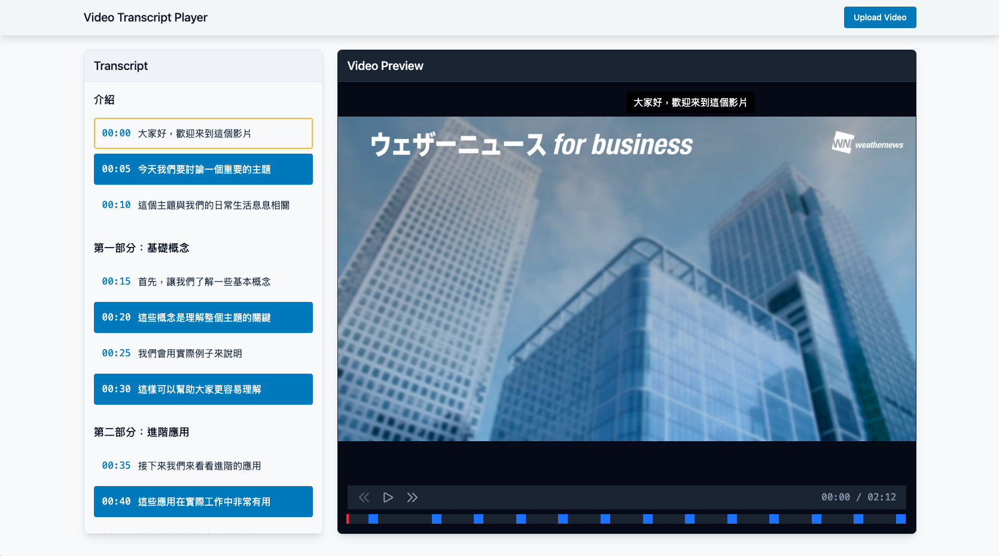

# Video Transcript Player 影片字幕播放器

[](https://coveralls.io/github/wuhenli/video-transcript-player?branch=main)
[](https://reactjs.org/)
[](https://www.typescriptlang.org/)
[](https://tailwindcss.com/)
[](https://vitest.dev/)
[](https://zustand-demo.pmnd.rs/)



## 🎯 專案概述

Video Transcript Player 是一個現代化的影片播放應用程式，專注於提供優質的影片播放體驗和字幕同步功能。本專案展示了我在前端開發領域的技術能力和最佳實踐的應用。

### 🌟 主要特色

- **影片播放控制**：支援基本播放控制、進度條拖曳
- **字幕同步顯示**：即時同步顯示字幕、支援字幕區塊自動捲動，字幕區塊可自由拖曳
- **響應式設計**：完美支援各種螢幕尺寸，提供最佳使用體驗

## 技術棧

### 技術架構

- React 18
- TypeScript
- Tailwind CSS
- Zustand
- Vite
- ESLint & Prettier
- GitHub Actions
- Vitest & Cypress

## 專案結構

```
├── src/                          # 源碼目錄
│   ├── components/               # React 元件
│   │   ├── __tests__/           # 元件測試檔案
│   │   │   ├── Header.test.tsx
│   │   │   ├── Layout.test.tsx
│   │   │   ├── Timeline.test.tsx
│   │   │   ├── VideoPlayer.test.tsx
│   │   │   └── ...
│   │   ├── Header.tsx           # 頁面標題元件
│   │   ├── Layout.tsx           # 佈局元件
│   │   ├── Loading.tsx          # 載入中元件
│   │   ├── Timeline.tsx         # 影片時間軸元件
│   │   ├── Toast.tsx            # 通知提示元件
│   │   ├── Transcript.tsx       # 字幕顯示元件
│   │   ├── TranscriptSection.tsx # 字幕區塊元件
│   │   ├── VideoCaption.tsx     # 影片字幕元件
│   │   ├── VideoControls.tsx    # 影片控制元件
│   │   └── VideoPlayer.tsx      # 影片播放器元件
│   ├── containers/               # 容器元件
│   │   ├── __tests__/           # 容器測試檔案
│   │   │   ├── TranscriptContainer.test.tsx
│   │   │   └── VideoPlayerContainer.test.tsx
│   │   ├── TranscriptContainer.tsx  # 字幕容器
│   │   └── VideoPlayerContainer.tsx # 播放器容器
│   ├── stores/                  # 狀態管理
│   │   └── videoStore.ts        # 影片相關狀態
│   ├── services/                # 服務層
│   │   ├── apis.ts              # API 介接
│   │   └── http.ts              # HTTP 請求封裝
│   └── mocks/                   # 模擬資料
│       ├── browser.ts           # 瀏覽器模擬
│       ├── handlers.ts          # 請求處理器
│       └── transcriptData.ts    # 字幕測試資料
├── cypress/                     # E2E 測試
│   ├── e2e/                     # 測試案例
│   ├── fixtures/                # 測試資料
│   └── support/                 # 測試支援
├── public/                      # 靜態資源
├── .github/                     # GitHub 配置
│   └── workflows/               # CI/CD 工作流程
├── package.json                 # 專案配置
├── tsconfig.json               # TypeScript 配置
├── vite.config.ts              # Vite 配置
├── tailwind.config.js          # Tailwind 配置
└── README.md                   # 專案文檔
```

## 🚀 開始使用

1. **安裝依賴**

   ```bash
   npm install
   ```

2. **開發模式**

   ```bash
   npm run dev
   ```

3. **執行測試**

   ```bash
   # 單元測試
   npm run test

   # E2E 測試
   npm run test:e2e

   # 測試覆蓋率報告
   npm run test:coverage
   ```

4. **建構專案**
   ```bash
   npm run build
   ```
